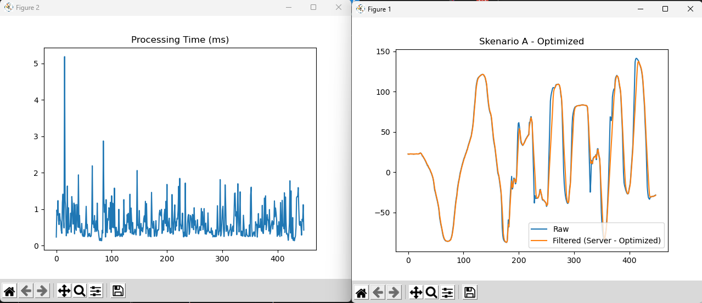
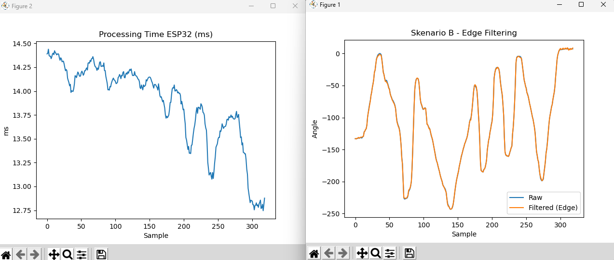

# 🚀 Cloud vs Edge Computing - Particle Filter

## 📌 Deskripsi

Proyek ini bertujuan untuk membandingkan performa **Particle Filter** pada dua pendekatan komputasi:

* **Cloud / Server-Side Filtering** menggunakan Raspberry Pi
* **Edge / Client-Side Filtering** menggunakan ESP32

Pengujian dilakukan menggunakan data dari sensor IMU yang dikirim melalui protokol UDP. Analisis difokuskan pada **waktu pemrosesan**, **stabilitas**, dan **kualitas hasil filtering**.

---

## ⚙️ Arsitektur Sistem

### 🔹 Skenario A — Cloud (Server-Side)

```
ESP32 → Raw Data (UDP) → Raspberry Pi → Filtering → Plotting
```

### 🔹 Skenario B — Edge (Client-Side)

```
ESP32 → Filtering → Data (UDP) → Raspberry Pi → Plotting
```

---

## 🧠 Metode

* **Algoritma**: Particle Filter
* **Jumlah Partikel**: 1000
* **Sensor**: IMU
* **Komunikasi**: UDP

**Platform:**

* ESP32 → Edge Computing
* Raspberry Pi → Server/Cloud

---

## 📊 Hasil Eksperimen

### 🔹 Skenario A — Server-Side Filtering

<p align="center">
  
</p>

* Processing sangat cepat (**< 1 ms**)
* Terdapat **jitter (spike hingga ~5 ms)**
* Tidak deterministik

---

### 🔹 Skenario B — Edge-Side Filtering

<p align="center">
  
</p>

* Processing lebih lambat (**~13 ms**)
* **Stabil dan konsisten**
* Deterministik (cocok untuk embedded system)

---

## 📈 Analisis

* **Raspberry Pi** unggul dalam kecepatan komputasi, tetapi memiliki jitter karena sistem berbasis OS
* **ESP32** lebih lambat, namun memberikan **stabilitas waktu eksekusi yang lebih baik**
* Hasil filtering dari kedua skenario **hampir identik**, menunjukkan bahwa:

  * Particle Filter berjalan efektif di ESP32
  * Tidak ada penurunan akurasi signifikan di edge

---

## ⚠️ Catatan Penting

Pengujian ini **belum mencakup end-to-end latency** (waktu total dari pengiriman hingga penerimaan data), sehingga belum dapat disimpulkan secara pasti skenario mana yang memiliki delay total lebih rendah.

---

## 🎯 Kesimpulan

* **Edge Computing (ESP32)**:

  * Lebih stabil dan deterministik
  * Cocok untuk sistem real-time dan kontrol

* **Cloud Computing (Raspberry Pi)**:

  * Lebih cepat dalam komputasi
  * Namun memiliki jitter

* **Particle Filter** terbukti dapat diimplementasikan secara efisien pada perangkat edge tanpa kehilangan kualitas hasil

---

🔗 Link
YouTube: [-](https://www.youtube.com/watch?v=roBRAQ4FuuM)

---


## 👤 Author

**Muhammad Najib**
